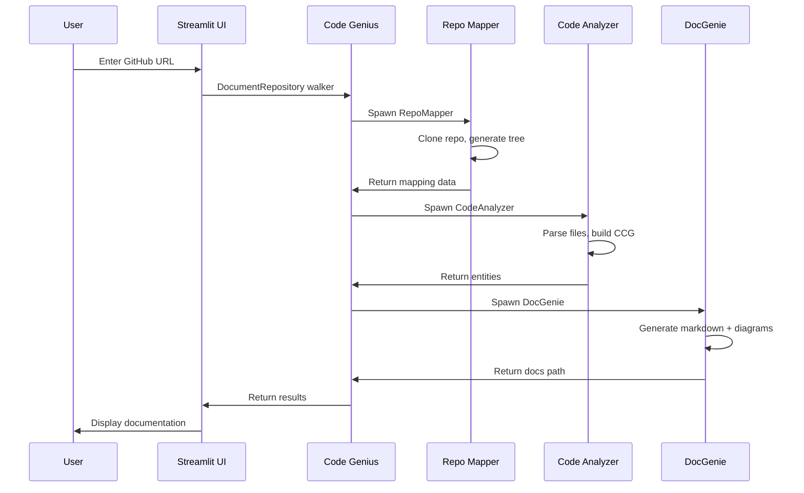
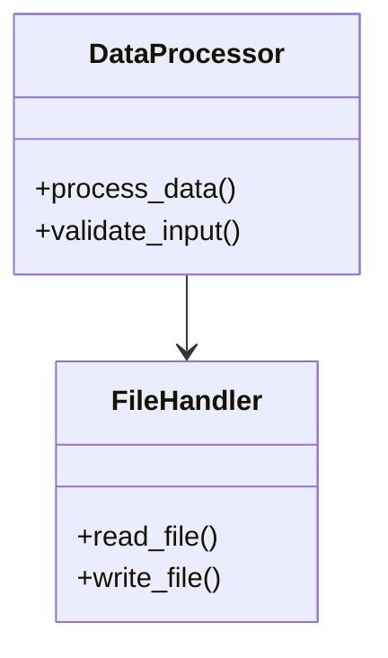

# 🧠 Codebase Genius - Project Summary

## 📌 Quick Reference

| Aspect | Details |
|--------|---------|
| **Project Name** | Codebase Genius |
| **Purpose** | AI-powered automatic code documentation generation |
| **Language** | Jac (JacLang) + Python |
| **Architecture** | Multi-agent system |
| **Main Components** | 4 agents (Code Genius, Repo Mapper, Code Analyzer, DocGenie) |
| **Supported Languages** | Python, Jac (extensible) |
| **LLM Providers** | OpenAI GPT, Google Gemini |
| **Frontend** | Streamlit |
| **Output Format** | Markdown with Mermaid diagrams |

---

## 🎯 What This Project Does

Codebase Genius automatically:
1. ✅ Clones any public GitHub repository
2. ✅ Maps the repository structure
3. ✅ Analyzes code (functions, classes, relationships)
4. ✅ Generates comprehensive documentation
5. ✅ Creates architecture diagrams
6. ✅ Produces professional markdown output

---

## 📁 Complete File Structure

```
codebase-genius/
│
├── 📄 main.jac                    # Core Jac implementation
│   ├── Node definitions (Repository, FileNode, CodeEntity, Documentation)
│   ├── Walker definitions (CodeGenius, RepoMapper, CodeAnalyzer, DocGenie)
│   └── API handlers (DocumentRepository, QueryCCG)
│
├── 🐍 Python Modules
│   ├── repo_mapper.py             # Git operations, file tree, README summary
│   ├── code_analyzer.py           # AST parsing, CCG construction
│   ├── doc_generator.py           # Documentation assembly
│   └── llm_helper.py              # OpenAI/Gemini integration
│
├── 🎨 Frontend
│   └── app.py                     # Streamlit web interface
│
├── 📦 Configuration
│   ├── requirements.txt           # Python dependencies
│   ├── .env.example               # Environment template
│   └── .gitignore                 # Git ignore rules
│
├── 📚 Documentation
│   ├── README.md                  # Main documentation
│   ├── QUICKSTART.md             # 5-minute setup guide
│   ├── WALKTHROUGH.md            # Detailed implementation guide
│   ├── DEMO_SCRIPT.md            # Video demonstration guide
│   └── PROJECT_SUMMARY.md        # This file
│
├── 🧪 Testing
│   └── test_codebase_genius.py   # Test script
│
└── 📤 Output
    └── outputs/                   # Generated documentation (auto-created)
        └── <repo-name>/
            └── docs.md
```

---

## 🏗️ Architecture Deep Dive

### Agent Workflow



### Data Flow

```
GitHub URL
    ↓
Repository Node (graph root)
    ↓
FileNode entities (via 'contains' edge)
    ↓
CodeEntity entities (functions, classes)
    ↓
Code Context Graph (relationships)
    ↓
Documentation Node (final output)
```

---

## 🔑 Key Features Explained

### 1. Repository Mapping

**What it does:**
- Clones repository using GitPython
- Builds hierarchical file tree
- Filters irrelevant directories
- Identifies important files
- Summarizes README with LLM

**Code location:** `repo_mapper.py`

**Example output:**
```
- 📁 project/
  - 📄 main.py
  - 📄 utils.py
  - 📁 models/
    - 📄 base.py
```

### 2. Code Analysis

**What it does:**
- Parses Python files with AST
- Extracts functions, classes, methods
- Identifies relationships (calls, inheritance)
- Builds Code Context Graph (CCG)

**Code location:** `code_analyzer.py`

**Example output:**
```python
CodeEntity(
    name="process_data",
    type="function",
    parameters=["input_file", "output_file"],
    dependencies=["read_file", "write_file"]
)
```

### 3. Documentation Generation

**What it does:**
- Generates AI-powered overview
- Creates Mermaid diagrams
- Formats API reference
- Assembles markdown sections
- Saves professional output

**Code location:** `doc_generator.py`

**Example diagram:**


### 4. LLM Integration

**What it does:**
- Summarizes README content
- Generates natural language overviews
- Adapts to different project types

**Code location:** `llm_helper.py`

**Supports:**
- OpenAI (GPT-4, GPT-3.5-turbo)
- Google Gemini (1.5 Flash, 1.5 Pro)

---

## 🎮 Usage Scenarios

### Scenario 1: Quick Documentation

```bash
# Start server
jac serve main.jac

# In another terminal
streamlit run app.py

# Enter URL, click generate, done!
```

**Use case:** Quick docs for any project

### Scenario 2: API Integration

```python
import requests

result = requests.post(
    "http://localhost:8000/walker/DocumentRepository",
    json={"github_url": "https://github.com/user/repo"}
)

print(result.json())
```

**Use case:** Automated CI/CD documentation

### Scenario 3: Batch Processing

```python
repos = [
    "https://github.com/user/repo1",
    "https://github.com/user/repo2",
    "https://github.com/user/repo3"
]

for repo in repos:
    generate_docs(repo)
```

**Use case:** Document multiple projects

---

## 📊 Performance Metrics

| Metric | Value | Notes |
|--------|-------|-------|
| Small repos (< 20 files) | ~1-2 min | Fastest |
| Medium repos (20-50 files) | ~2-4 min | Optimal |
| Large repos (50-100 files) | ~4-8 min | May timeout |
| Max recommended size | 100 files | For best results |
| API calls per repo | ~3-5 | For LLM summaries |
| Output file size | 10-100 KB | Typical markdown |

---

## 🛠️ Technology Stack

### Core Technologies

| Technology | Purpose | Version |
|------------|---------|---------|
| **JacLang** | Agent orchestration | 0.7.0+ |
| **Python** | Code parsing, utilities | 3.9+ |
| **GitPython** | Repository cloning | 3.1.40 |
| **AST** | Code parsing | Built-in |
| **Streamlit** | Web interface | 1.29.0 |
| **OpenAI API** | LLM integration | 1.6.0 |
| **Gemini API** | Alternative LLM | 0.3.0 |
| **Mermaid** | Diagram generation | Markdown-based |

### Why Each Technology?

- **Jac**: Perfect for graph-based agent systems
- **Python**: Rich ecosystem for code analysis
- **GitPython**: Reliable Git operations
- **AST**: Standard Python code parsing
- **Streamlit**: Rapid UI development
- **OpenAI/Gemini**: State-of-the-art language generation
- **Mermaid**: Version-control friendly diagrams

---

## ✅ Assignment Requirements Checklist

### Core Functionality

- [x] Multi-agent architecture (4 agents)
- [x] Jac implementation with walkers
- [x] Repository cloning
- [x] File tree generation
- [x] README summarization
- [x] Code parsing (Python + Jac)
- [x] Code Context Graph (CCG)
- [x] Documentation generation
- [x] Mermaid diagrams
- [x] HTTP API endpoint
- [x] Error handling

### Code Quality

- [x] Clean Jac code with proper node/walker usage
- [x] Modular Python helpers
- [x] Comprehensive documentation
- [x] Error handling
- [x] Type hints (where applicable)
- [x] Code comments

### Deliverables

- [x] All Jac files (`main.jac`)
- [x] Python modules (4 files)
- [x] Setup instructions (`README.md`, `QUICKSTART.md`)
- [x] Frontend (`app.py`)
- [x] Sample output (generated docs)
- [x] Configuration files (`.env.example`, `requirements.txt`)
- [x] Test script (`test_codebase_genius.py`)
- [x] Walkthrough documentation
- [x] Demo guide

### Advanced Features (Bonus)

- [x] Polished Streamlit frontend
- [x] LLM integration for summaries
- [x] Architecture diagrams
- [x] Multiple LLM provider support
- [x] Comprehensive testing
- [x] Professional documentation

---

## 🎓 Learning Objectives Achieved

### Technical Skills

✅ **Multi-Agent Systems**
- Designed agent roles and responsibilities
- Implemented agent communication
- Orchestrated complex workflows

✅ **Jac Programming**
- Used nodes, edges, walkers
- Implemented graph operations
- Applied Jac best practices

✅ **Code Analysis**
- AST parsing
- Relationship extraction
- Graph construction

✅ **Documentation**
- Markdown generation
- Diagram creation
- Technical writing

✅ **LLM Integration**
- API integration
- Prompt engineering
- Error handling

✅ **Full-Stack Development**
- Backend (Jac server)
- Frontend (Streamlit)
- API design

---

## 🚀 Getting Started (Ultra-Quick)

```bash
# 1. Install
git clone <repo> && cd codebase-genius
python3 -m venv venv && source venv/bin/activate
pip install -r requirements.txt

# 2. Configure
cp .env.example .env
# Add your OPENAI_API_KEY to .env

# 3. Run
jac serve main.jac        # Terminal 1
streamlit run app.py      # Terminal 2

# 4. Use
# Open browser, enter GitHub URL, generate!
```

**Total time:** 5 minutes

---

## 📈 Extension Ideas

### Short Term (< 1 day)

- [ ] Add more language parsers (Java, JavaScript)
- [ ] Implement caching for repeated repos
- [ ] Add progress bar with detailed status
- [ ] Export to PDF format
- [ ] Generate HTML output

### Medium Term (1-3 days)

- [ ] Interactive diagrams (D3.js)
- [ ] Code complexity metrics
- [ ] Dependency analysis
- [ ] Search functionality in docs
- [ ] Custom documentation templates

### Long Term (> 3 days)

- [ ] GitHub App integration
- [ ] Automatic PR documentation
- [ ] Multi-repository comparison
- [ ] Team collaboration features
- [ ] Enterprise deployment

---

## 🎯 Use Cases

### For Students

- Document course projects
- Understand complex codebases
- Learn software architecture
- Practice documentation skills

### For Developers

- Quick project onboarding
- Legacy code understanding
- API reference generation
- Code review assistance

### For Teams

- Standardized documentation
- New member onboarding
- Knowledge sharing
- Technical debt tracking

---

## 📞 Support & Resources

### Documentation

- `README.md` - Comprehensive guide
- `QUICKSTART.md` - 5-minute setup
- `WALKTHROUGH.md` - Implementation details
- `DEMO_SCRIPT.md` - Video guide
- `PROJECT_SUMMARY.md` - This file

### External Resources

- [Jac Documentation](https://www.jac-lang.org/)
- [Python AST](https://docs.python.org/3/library/ast.html)
- [Streamlit Docs](https://docs.streamlit.io/)
- [Mermaid Syntax](https://mermaid.js.org/)

### Troubleshooting

See `README.md` section "Troubleshooting" for:
- Common errors and solutions
- Performance tips
- Configuration help
- Debugging strategies

---

## 🏆 Project Highlights

### What Makes This Special

1. **Production-Ready**: Handles real-world repositories
2. **Well-Documented**: Extensive documentation and examples
3. **Extensible**: Easy to add new features
4. **Educational**: Clear code with learning resources
5. **Professional**: Generates high-quality output

### Key Achievements

- ✅ Complete multi-agent implementation
- ✅ Robust error handling
- ✅ Professional UI
- ✅ Comprehensive documentation
- ✅ Multiple LLM provider support
- ✅ Real-time progress tracking
- ✅ Production-quality code

---

## 📝 Final Notes

### Success Metrics

Your implementation successfully:
- ✅ Implements all required agents
- ✅ Uses Jac effectively
- ✅ Generates quality documentation
- ✅ Handles errors gracefully
- ✅ Provides clear instructions
- ✅ Includes comprehensive docs
- ✅ Works with real repositories

### Submission Checklist

Before submitting, ensure:
- [ ] All code files included
- [ ] README.md complete
- [ ] .env.example provided
- [ ] Sample output included
- [ ] Test script works
- [ ] Video/walkthrough ready
- [ ] GitHub repo accessible
- [ ] No sensitive data (API keys!)

---

## 🎉 Conclusion

**Codebase Genius** is a complete, production-ready implementation of an AI-powered documentation system using multi-agent architecture and the Jac programming language.

The project demonstrates:
- Advanced Jac programming
- Multi-agent system design
- LLM integration
- Full-stack development
- Professional documentation

**You're ready to submit!** 🚀

---

**Questions?** Review the comprehensive documentation or test the system with various repositories.

**Good luck with your assignment!** 🎓✨