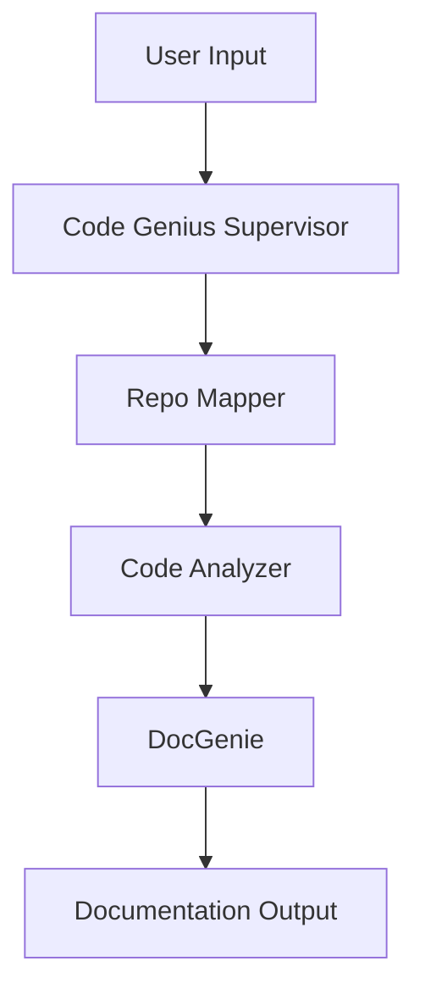

# 🧠 Codebase Genius

An AI-powered, multi-agent system that automatically generates high-quality documentation for any software repository.

## 📋 Table of Contents

- [Features](#features)
- [Architecture](#architecture)
- [Prerequisites](#prerequisites)
- [Installation](#installation)
- [Configuration](#configuration)
- [Usage](#usage)
- [Project Structure](#project-structure)
- [How It Works](#how-it-works)
- [Troubleshooting](#troubleshooting)
- [License](#license)

## ✨ Features

- 🗺️ **Repository Mapping**: Automatically clones and maps repository structure
- 🔍 **Code Analysis**: Parses Python and Jac files to extract functions, classes, and relationships
- 📊 **Architecture Diagrams**: Generates Mermaid diagrams showing code structure
- 📝 **Documentation Generation**: Creates comprehensive markdown documentation
- 🌐 **Web Interface**: User-friendly Streamlit UI for easy interaction
- 🤖 **Multi-Agent System**: Built using Jac language with specialized agents

## 🏗️ Architecture

Codebase Genius uses a multi-agent architecture with four main agents:

1. **Code Genius (Supervisor)**: Orchestrates the entire workflow
2. **Repo Mapper**: Clones repository and generates file tree
3. **Code Analyzer**: Parses code and builds Code Context Graph (CCG)
4. **DocGenie**: Synthesizes final documentation with diagrams



## 📦 Prerequisites

- **Python 3.9+**
- **JacLang 0.7.0+**
- **Git**
- **OpenAI API Key** or **Google Gemini API Key**

## 🚀 Installation

### Step 1: Clone the Repository

```bash
git clone <your-repository-url>
cd codebase-genius
```

### Step 2: Create Virtual Environment

```bash
python3 -m venv venv

# On Linux/Mac:
source venv/bin/activate

# On Windows:
venv\Scripts\activate
```

### Step 3: Install Dependencies

```bash
pip install -r requirements.txt
```

### Step 4: Install Jac Language

```bash
pip install jaclang
```

## ⚙️ Configuration

### Step 1: Create Environment File

Copy the example environment file:

```bash
cp .env.example .env
```

### Step 2: Add Your API Key

Edit `.env` and add your API key:

```bash
# For OpenAI (recommended)
OPENAI_API_KEY=sk-your-key-here
LLM_PROVIDER=openai

# OR for Google Gemini
GEMINI_API_KEY=your-gemini-key-here
LLM_PROVIDER=gemini
```

### Step 3: (Optional) Configure Output Directory

The default output directory is `./outputs`. You can change this in the Streamlit UI or by modifying the code.

## 🎮 Usage

### Option 1: Using the Web Interface (Recommended)

#### Start the Jac Server

In one terminal:

```bash
# Make sure you're in the virtual environment
source venv/bin/activate  # or venv\Scripts\activate on Windows

# Start the Jac server
jac serve main.jac
```

You should see:
```
Server running on http://localhost:8000
```

#### Start the Streamlit Frontend

In another terminal:

```bash
# Make sure you're in the virtual environment
source venv/bin/activate  # or venv\Scripts\activate on Windows

# Run Streamlit
streamlit run app.py
```

The web interface will open in your browser (usually at `http://localhost:8501`).

#### Generate Documentation

1. Enter a GitHub repository URL (e.g., `https://github.com/navdeep-G/samplemod`)
2. Click "🚀 Generate"
3. Wait for processing (may take 1-5 minutes)
4. View or download the generated documentation

### Option 2: Using HTTP API Directly

You can also interact with the Jac server using HTTP requests:

```bash
curl -X POST http://localhost:8000/walker/DocumentRepository \
  -H "Content-Type: application/json" \
  -d '{
    "github_url": "https://github.com/navdeep-G/samplemod",
    "output_dir": "./outputs"
  }'
```

### Option 3: Using Python Script

Create a file `test_generate.py`:

```python
import requests

response = requests.post(
    "http://localhost:8000/walker/DocumentRepository",
    json={
        "github_url": "https://github.com/navdeep-G/samplemod",
        "output_dir": "./outputs"
    }
)

print(response.json())
```

Run it:

```bash
python test_generate.py
```

## 📁 Project Structure

```
codebase-genius/
├── main.jac                 # Main Jac implementation with all walkers
├── repo_mapper.py          # Repository cloning and mapping
├── code_analyzer.py        # Code parsing and analysis
├── doc_generator.py        # Documentation generation
├── llm_helper.py           # LLM integration (OpenAI/Gemini)
├── app.py                  # Streamlit frontend
├── requirements.txt        # Python dependencies
├── .env.example            # Environment variable template
├── README.md               # This file
└── outputs/                # Generated documentation (created automatically)
    └── <repo-name>/
        └── docs.md
```

## 🔍 How It Works

### 1. Repository Mapping

The **Repo Mapper** agent:
- Clones the GitHub repository to a temporary directory
- Generates a hierarchical file tree (ignoring `.git`, `node_modules`, etc.)
- Reads and summarizes the README using an LLM
- Identifies important files to analyze (prioritizes entry points like `main.py`)

### 2. Code Analysis

The **Code Analyzer** agent:
- Parses Python files using Python's `ast` module
- Extracts functions, classes, methods, and their relationships
- Builds a Code Context Graph (CCG) showing:
  - Function calls
  - Class inheritance
  - Module imports
  - Method dependencies

### 3. Documentation Generation

The **DocGenie** agent:
- Aggregates all analyzed data
- Generates structured markdown documentation with:
  - Project overview (AI-generated)
  - Installation instructions
  - Repository structure
  - Architecture diagrams (Mermaid)
  - Code statistics
  - Detailed API reference
- Saves documentation to `outputs/<repo-name>/docs.md`

## 📊 Sample Output

The generated documentation includes:

- **Overview**: AI-generated project description
- **Installation**: Setup instructions based on detected files
- **Repository Structure**: Visual file tree
- **Architecture**: Mermaid class diagram
- **Code Statistics**: Counts of classes, functions, etc.
- **API Reference**: Detailed documentation of all code entities

Example:

```markdown
# myproject - Documentation

## 🎯 Overview

This project implements a data processing pipeline for analyzing...

## 📦 Installation

```bash
pip install -r requirements.txt
```

## 📂 Repository Structure

- 📁 **myproject/**
  - 📄 main.py
  - 📄 utils.py
  - 📁 **models/**
    - 📄 base.py

## 🏗️ Architecture

[Mermaid diagram here]

## 📚 API Reference

### 📄 `main.py`

#### Functions

##### `process_data(input_file, output_file)`
Processes data from input file and writes to output file...
```

## 🐛 Troubleshooting

### Server Won't Start

**Problem**: `jac serve main.jac` fails

**Solution**:
- Ensure Jac is installed: `pip install jaclang`
- Check Python version: `python --version` (needs 3.9+)
- Try: `jac --version` to verify installation

### API Key Errors

**Problem**: "API key not found" or authentication errors

**Solution**:
- Verify `.env` file exists and contains your key
- Ensure no extra spaces in the key
- Check the key is valid on OpenAI or Google Cloud console

### Repository Clone Fails

**Problem**: "Failed to clone repository"

**Solution**:
- Verify the URL is correct and accessible
- For private repos, you need a GitHub token
- Check your internet connection

### Import Errors

**Problem**: "Module not found" errors

**Solution**:
```bash
pip install --upgrade -r requirements.txt
```

### Large Repository Timeout

**Problem**: Generation takes too long or times out

**Solution**:
- Start with smaller repositories (< 50 files)
- Increase timeout in `app.py` (line with `timeout=300`)
- The system is optimized for Python/Jac; other languages may be slower

### Streamlit Won't Connect to Server

**Problem**: "Cannot connect to Jac server"

**Solution**:
- Ensure Jac server is running first
- Check server URL: should be `http://localhost:8000`
- Verify no firewall blocking port 8000

## 🧪 Testing

Test with a simple repository:

```bash
# Example: Simple Python project
https://github.com/navdeep-G/samplemod

# Example: Small utility
https://github.com/kennethreitz-archive/tablib
```

## 🎯 Best Practices

1. **Start Small**: Test with repositories under 50 files
2. **Check README**: Repositories with good READMEs generate better docs
3. **Use Python/Jac**: System is optimized for these languages
4. **Monitor Output**: Check terminal for progress and errors
5. **API Limits**: Be mindful of OpenAI API rate limits

## 🔮 Future Enhancements

- Support for more programming languages
- Advanced code metrics (cyclomatic complexity, code coverage)
- Interactive diagram generation
- PDF export
- Custom documentation templates
- GitHub integration for automatic PR documentation

## 📄 License

This project is for educational purposes as part of an assignment.

## 🙏 Acknowledgments

- Built with [JacLang](https://www.jac-lang.org/)
- Inspired by the byLLM Task Manager example
- Uses OpenAI GPT or Google Gemini for natural language generation

---

**Made with ❤️ by Codebase Genius**

For questions or issues, please check the troubleshooting section.